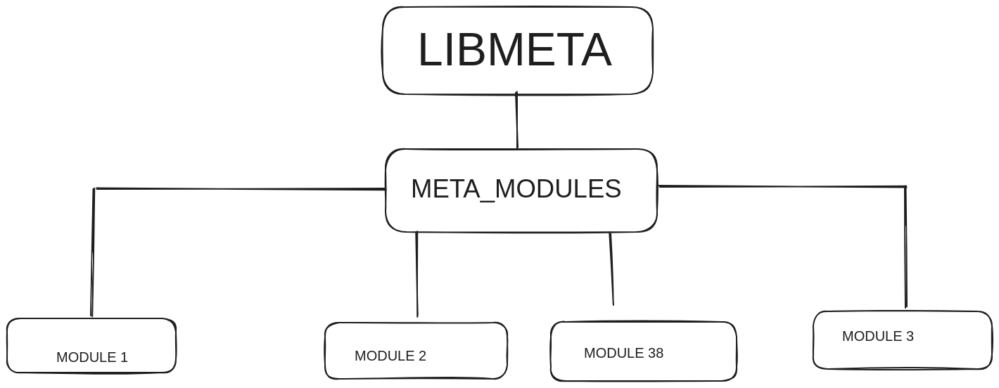

# libmeta
A modular static library for c projects
# Modular and static ???
libmeta does not work like a shared-object (.so) file.
The concept of modularity involves the ability to use only sections of libmeta like in c standard library
an example of this is 
```c
#include <stdio.h>
```
which is not only a header but a type of library injected into your code.


# Meta_modules

